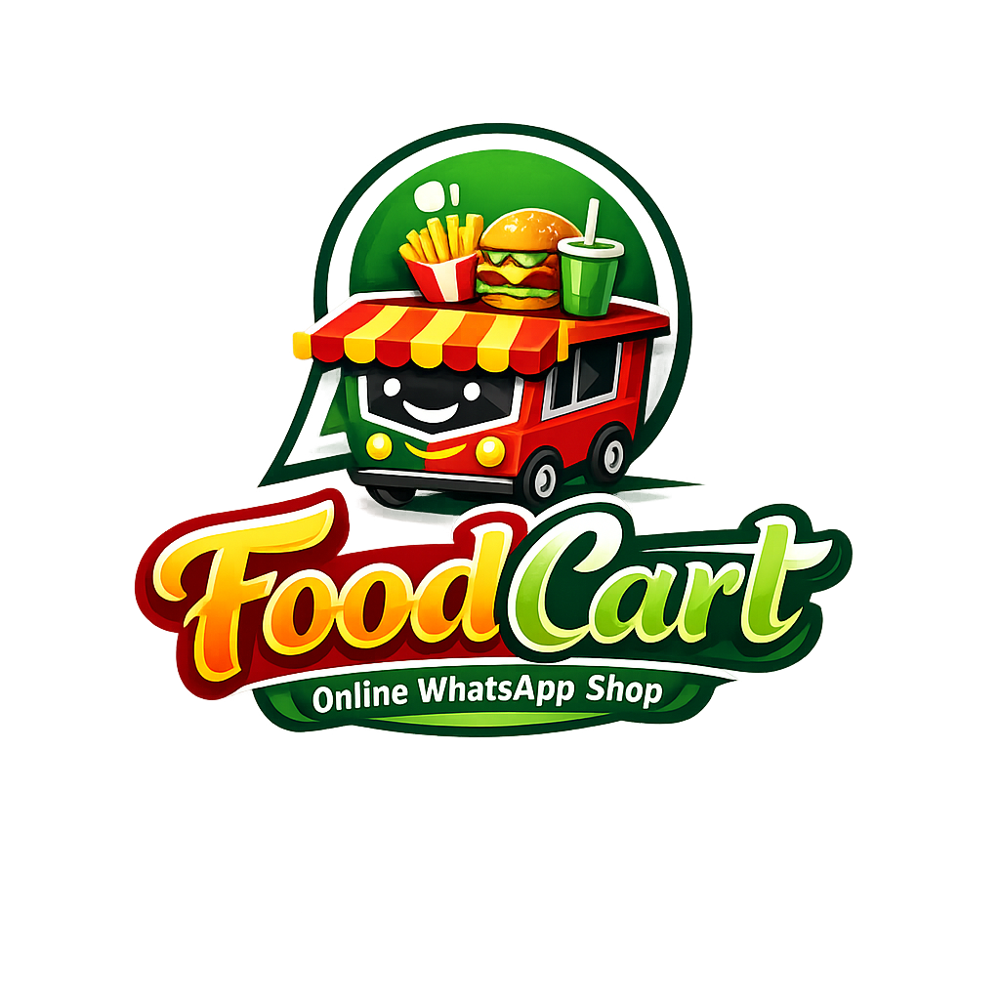

# FoodCart - Direct-to-Consumer Cloud Kitchen


FoodCart is a static web infrastructure built for a localized cloud kitchen operating in Knowledge Park 3, Greater Noida. 

**What it is made for:** It is designed to completely bypass third-party food delivery aggregators (like Swiggy or Zomato) by giving the business its own independent, professional digital storefront. The platform routes all customer interest directly into a functional WhatsApp chat rather than a complex checkout pipeline.

**The Impact:** By removing mandatory account creations and clunky carts, this architecture aggressively reduces user friction, resulting in much higher order transition rates. Operationally, it allows the brand to avoid high aggregator commission fees, instantly establish the required legal/structural legitimacy to get verified by Meta Business APIs, and build a direct CRM relationship with their local returning customers via WhatsApp.

---

## ✨ Core Mechanics

* **📱 WhatsApp-First Ordering:** Every call-to-action seamlessly bridges the user from the web to WhatsApp (`wa.me`) with a pre-filled ordering intent message.
* **⚡ Frictionless Architecture:** Built purely on HTML, CSS, and JS. The lack of framework bloat ensures the menu loads instantly for users even on slow mobile networks.
* **🔍 Legitimacy & Verification:** Includes fully written `Terms`, `Privacy`, `About`, and `Contact` pages integrated with interactive Google Maps. This fulfills the strict verification requirements necessary for Meta / Facebook / WhatsApp Business API approvals.
* **🖼️ Dynamic Category Filtering:** Real-time JavaScript DOM filtering across menu items (Mains, Sides, Beverages) without page reloads.

## 📁 Project Structure

```text
/FoodCart
│
├── index.html        # Landing page featuring hero, trust badges, and process steps
├── menu.html         # Full catalog with dynamic JS filtering capabilities
├── contact.html      # Business contact details and embedded interactive Google Map
├── about.html        # Brand story and kitchen origin
├── terms.html        # Terms & Conditions (Legal)
├── privacy.html      # Privacy Policy (Legal)
├── refund.html       # Refund & Cancellation Policies (Legal)
│
├── index.css         # Global stylesheets, responsive grids, and CSS animations
├── script.js         # Navigation toggle, scroll reveals, and catalog filtering
├── vercel.json       # Vercel deployment config for clean URLs & caching
├── logo.png          # Primary brand identity icon
│
└── assets/           # High-resolution, AI-generated culinary photography
```

## 🚀 Deployment Instructions (Vercel)

This application is strictly statically hosted and natively configured for **Vercel** with optimized configurations including clean URLs (stripping out `.html` extensions) and aggressive image caching.

1. Create a free account at [Vercel](https://vercel.com).
2. Drag and drop the `FoodCart` directory straight into your Vercel Dashboard OR push this repository to GitHub and click **Import Project**.
3. Leave all framework settings to **"Other"**.
4. Leave Build Command and Output Directory **blank**.
5. Click **Deploy**.

## 🛠 Local Development

If you wish to edit the files locally and instantly see the results:

1. Open your terminal in the root directory.
2. If you have Node.js installed, run:
   ```bash
   npx http-server -p 8080 -c-1
   ```
3. Open `http://localhost:8080` in your web browser. 
*(The `-c-1` flag disables caching so your latest CSS/JS edits reflect immediately upon refreshing).*

---

*Designed and engineered specifically to scale FoodCart's regional delivery footprint.*
